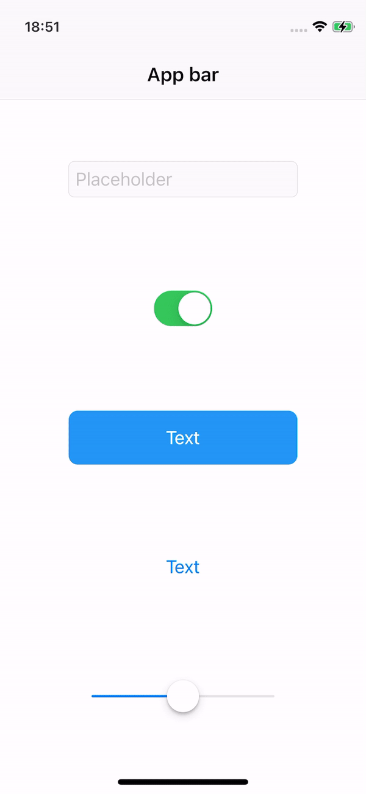

# 404fest_flutter

In this repo, we're working on code samples to demonstrate Flutter features at [404 Fest, 25-26 Sep 2021, Samara](https://2021.404fest.ru).

## Neumorphic [/crypto_wallet](https://github.com/anemchinova/404fest_flutter/tree/main/lib/crypto_wallet)

Inspired by [Crypto Mobile App Design](https://dribbble.com/shots/16442896-Crypto-Mobile-App-Design)

## Onboarding Animation [/onboard](https://github.com/anemchinova/404fest_flutter/tree/main/lib/onboard)

Inspired by [Principle Tutorial Onboarding Flow Animation](https://dribbble.com/shots/12580831-Principle-Tutorial-Onboarding-Flow-Animation)

## Native Controls Switcher [/native_interfaces_comparer](https://github.com/anemchinova/404fest_flutter/tree/main/lib/native_interfaces_comparer)

## Instagram [/instagram](https://github.com/anemchinova/404fest_flutter/tree/main/lib/instagram)

Inspired by you know what 😊

<TABLE BORDER>
	<TR>
		<TD></TD> 
        <TD></TD>
	</TR>
</TABLE>
